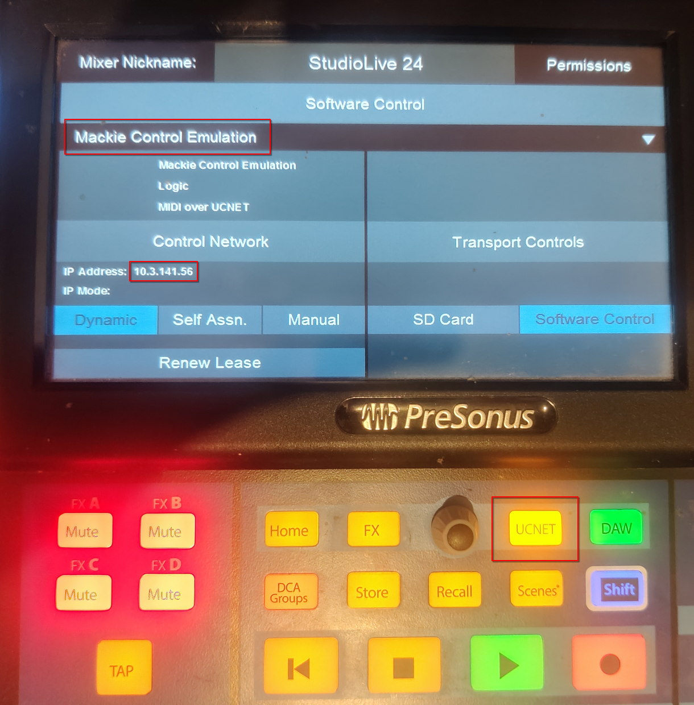
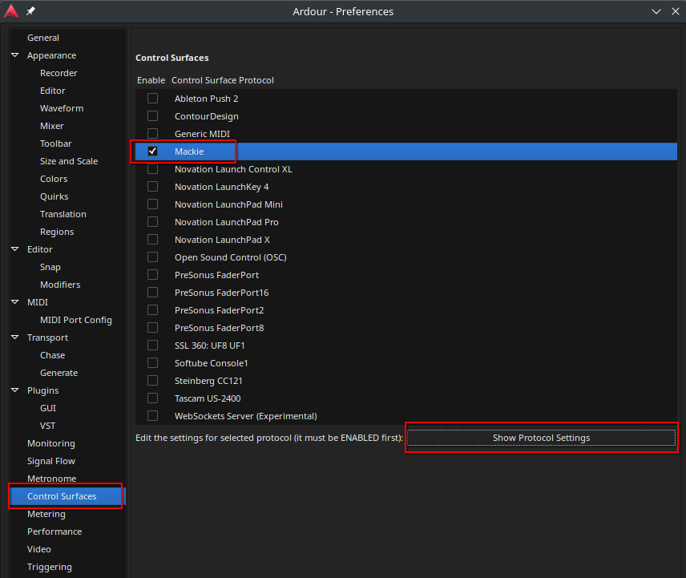
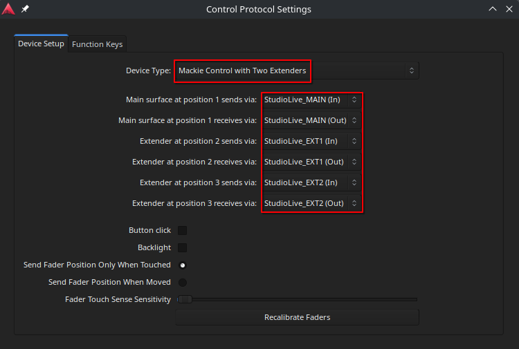

# sls3_mcu_bridge

sls3_mcu_bridge is a cli tool created to enable "DAW control" of the "Presonus Studio Live Series III" product line on Linux. Presonus create Universal Conrol to act as a bridge which translates the TCP network communication of the Studio Live to Midi usable in multiple Digital Audio Workstations (DAW). Due ot Universal Control not being available for Linux, sls3_mcu_bridge is born.

## Usage
### Start Bridge
- Connect your Presonus Studio Live Series III with the `controll` ethernet port to your network.
- Get the ip address from the mixer by opening the `UCNET` menu using the `UCNET` button on the mixer.

- Start the bridge by executing:
 `sls3_mcu_bridge -h <ip_address>`

### Connect in DAW
#### Ardour
- Open Ardour
- Select `ALSA` in "Window' -> "Audio/MIDI Setup"
- Go to "Edit" -> "Preferences" -> "Control Surfaces" and enable Mackie.


- When Mackie is selected click on "Show Protocol Settings"
- Depending on the StudilLive mixer you have select the correct Device Type.
  - 8 faders -> Mackie Control
  - 16 faders -> Mackie Control with One Extender
  - 24 faders -> Mackie Control with Two Extenders
- Select the correct MIDI send and receive ports
  - positon 1 = MAIN
  - position 2 = EXT1
  - position 3 = EXT2



- Enjoy
## Installation
```
git clone https://github.com/Ruudjhuu/sls3_mcu_bridge.git
cd sls3_mcu_bridge
mkdir build
cd build
cmake ..
cmake --build .

#use the bridge
./bin/sls3_mcu_bridge <options>
```

## Confirmed Devices
I own a "StudioLive 24" with frimware version `2.7.2.97745` for which I can confirm this software works.

If you can confirm or have issues with other devices/firmware versions, please create a github issue.

## Contributing
If you want to contribute to this project, fork this repository and create a pull request.